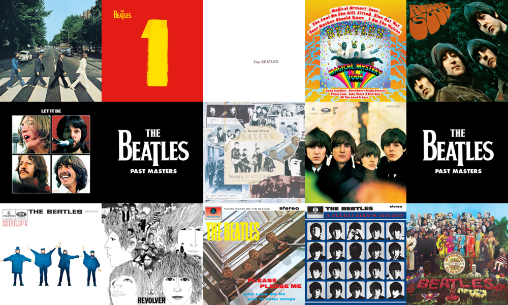

# Spotify Album Art Collage


spotify-collage.pl takes a url to a Spotify playlist and stitches a collage of album art images of the tracks in that playlist.

- The album art images are resized to 200x200 pixels
- The images are laid out in a 4:3 grid
- The generated collage is saved in .png format in the folder that you run this script in.

### Usage

```
perl spotify-collage.pl --playlist https://open.spotify.com/user/beatlesplaylists/playlist/1FbXE0DKfcNlIRexSEHcs8
```

```
Fetching bearer token
Fetching page: 1
Found 50 tracks from 17 unique albums with album art.
/var/folders/pj/j3y2rdf17l51zqhcmqfy6lnr0000gn/T/spotify-montage-y76S
Downloading 1 of 17
Downloading 2 of 17
Downloading 3 of 17
Downloading 4 of 17
Downloading 5 of 17
Downloading 6 of 17
Downloading 7 of 17
Downloading 8 of 17
Downloading 9 of 17
Downloading 10 of 17
Downloading 11 of 17
Downloading 12 of 17
Downloading 13 of 17
Downloading 14 of 17
Downloading 15 of 17
Downloading 16 of 17
Downloading 17 of 17
Filling 17 images into a collage of 3 rows and 5 columns
Montage written to ./spotify-montage-QRht.png
```
If you run it without the --playlist option, it'll use this hardcoded playlist with 8 songs: https://open.spotify.com/user/deepak.gulati/playlist/7EhvGQRwc71oEpRjvEV6uR

### Dependencies

This script has following external dependencies that you'd need to install from CPAN:

- Config::INI::Reader
- Imager::Montage
- JSON::XS

I've only tested this script on macOS 10.12.3. If you have a working installation of Perl 5.14 or higher and are able to install the dependencies, it *should* work on older versions of macOS as well. It might work on Linux with little or no tweaking but about Windows I am considerably less sure.
